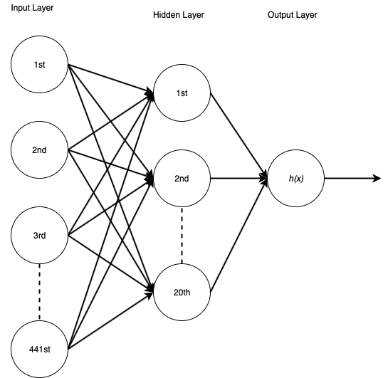
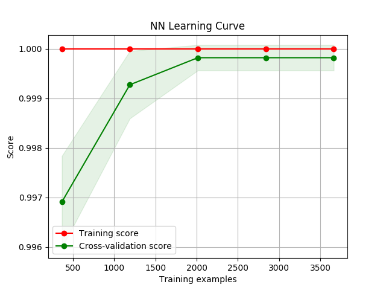
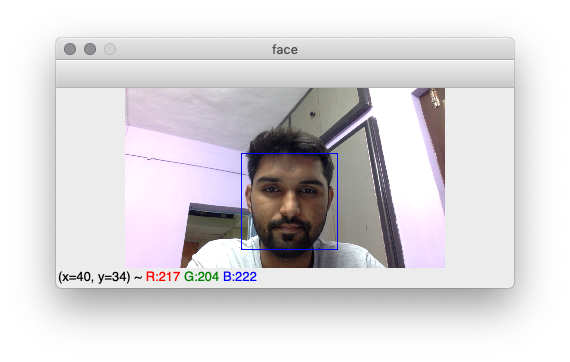
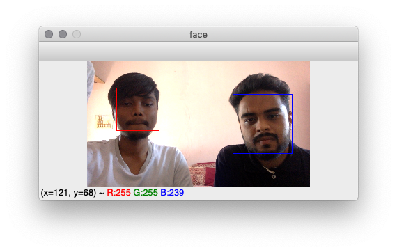
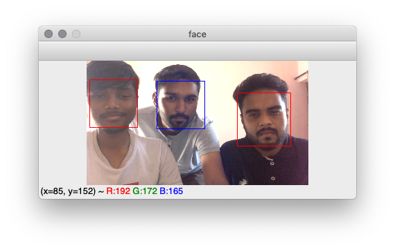

# Face Recognition using Neural Network

It is pretty easy for human to recognise each person individually because we are able to understand and remember human facial features like eyes, nose, shape, e.t.c; but it is difficult for the machines as for them  the input, basically image or video frame, is a grid of random numbers arranged together. To make machines able to recognise faces we need to train them to understand the facial features of a person. Fundamentally, this is done by training machines to look for group of pixels which act as a facial feature and use them to understand the image. Here, we are using a HAAR cascade classifier to detect faces in the image and then feeding these faces to our Neural Network to recognise the person for whom our network is trained for.

<h2>Steps Involved</h2>
<ol>
  <li>Generating the Data</li>
  <li>Training and Testing the Model</li>
  <li>Running the Model</li>
</ol>

<h2>1. Generating the Data</h2>

The reposistory contains the script <i>get_data.py</i> which can be used to generate data. I had used data consisting of around 5,000 face samples from 5 people where 4 of them were labeled negative and 1 was positive. Each sample in the dataset was a 21X21 grayscale image totalling to 441 pixels each. The program is built to work with these numbers, but can be easily tweaked according to the requirements.

While generating the data, the program expects that your current directory should have two label directories named <i>positive </i> and <i>negative</i>. It will ask for label and name(person's name whose face is being recorded), and will store the images in directory <i>cur_dir\label\name</i>. Once the required <i>positive</i> and <i>negative</i> data is generated, running <i>set_data.py</i> will generate <i>data_set.csv</i> with *mX442* table size. Where *m* is number of samples, combining *positive* and *negative*, 0-441 is pixel values for each sample and 442 is label associated with the sample.

<h2>2. Training the Model</h2>

The data from *data_set.csv* file is extracted by *train_model.py* script and used to train a three layer Artificial Neural Network. The neural network uses a 20 units hidden layer and the logistic function for activation of each unit. The l-bfgs , quasi-Newton family methods, solver is used to optimise weights in the network and the generated model is regularised by 0.3 lambda L2 regularisation.

The *train_model.py* along with training the model also tests the model and generates *learning curve* by leveraging *plot_learning_curve.py*. The curve plotting method in *plot_learning_curve.py* is provided by Scikit team and documented <a href="https://scikit-learn.org/stable/auto_examples/model_selection/plot_learning_curve.html#sphx-glr-auto-examples-model-selection-plot-learning-curve-py">here</a>.

From the above graph we can say that our classifier is not the best but performs good on our data and there is room for improvement by increasing our dataset. The train_model.py stores the classifier in *nn_clf.joblib* file for further use.

<h2>3. Running the Model</h2>

Using our classifier from *nn_clf.joblib* in *predict_face.py* script we can now recognise face from our video feed. The recognised face is marked by blue square and others are marked by red square.

As you can see in images 1st and 2nd, the program detects blue for positive and red for negative. In the 3rd the classifier is able to pick-out positive and negative classes together. 
